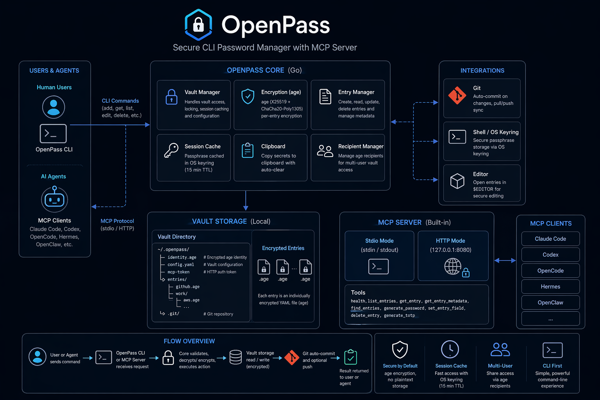

# OpenPass


A modern, secure command-line password manager written in Go. OpenPass uses [age](https://age-encryption.org/) for encryption and provides an intuitive CLI interface for managing your secrets — with built-in MCP server support for AI agent integration.

## Safety Notice

OpenPass manages sensitive secrets. Use it at your own risk, keep tested backups
of your vault, and verify recovery before relying on it for critical credentials.

## Contributing

Contributions are welcome! See [CONTRIBUTING.md](CONTRIBUTING.md) for development setup, code style guidelines, testing requirements, and the PR process.

## Code of Conduct

Please read our [Code of Conduct](CODE_OF_CONDUCT.md) before participating in our community.

## Features

- **Modern Encryption**: Uses [age](https://age-encryption.org/) (X25519 + ChaCha20-Poly1305) instead of GPG
- **TOTP Support**: Store TOTP secrets alongside passwords, generate codes on the fly
- **Clipboard Auto-Clear**: Copies to clipboard with automatic clearing after timeout
- **Session Caching**: Passphrase cached securely via OS keyring (15-minute TTL)
- **Git Integration**: Automatic commits and optional sync with Git repositories
- **Multi-User Vaults**: Manage age recipients for shared vault access
- **MCP Server**: Built-in Model Context Protocol server for AI agent access (stdio and HTTP)
- **Cross-Platform**: Works on macOS, Linux, and Windows

## Installation

### Quick install (recommended)

**macOS / Linux:**

```bash
curl -sSfL https://raw.githubusercontent.com/danieljustus/OpenPass/main/scripts/install.sh | sh
```

**Windows (PowerShell):**

```powershell
irm https://raw.githubusercontent.com/danieljustus/OpenPass/main/scripts/install.ps1 | iex
```

The installer downloads the release binary, verifies the SHA-256 checksum, and installs it.

**Options:**

| Flag / Env var | Default | Description |
|----------------|---------|-------------|
| `--version` / `VERSION` | latest | Install a specific version |
| `--install-dir` / `INSTALL_DIR` | `/usr/local/bin` (Linux/macOS), `%LOCALAPPDATA%\Programs\OpenPass` (Windows) | Installation directory |
| `--dry-run` / `DRY_RUN=true` | false | Download and verify without installing |

Examples:

```bash
# Install a specific version
curl -sSfL https://raw.githubusercontent.com/danieljustus/OpenPass/main/scripts/install.sh | sh -s -- --version 1.2.3

# Install to a custom directory
curl -sSfL https://raw.githubusercontent.com/danieljustus/OpenPass/main/scripts/install.sh | sh -s -- --install-dir ~/.local/bin

# Dry run (verify only)
curl -sSfL https://raw.githubusercontent.com/danieljustus/OpenPass/main/scripts/install.sh | sh -s -- --dry-run
```

### Homebrew (macOS / Linux)

```bash
brew tap danieljustus/tap
brew install openpass
```

### Manual download

Download a prebuilt binary from the latest release:

https://github.com/danieljustus/OpenPass/releases/latest

### Go

```bash
go install github.com/danieljustus/OpenPass@latest
```

### Build from source

```bash
git clone https://github.com/danieljustus/OpenPass
cd OpenPass
go build -o openpass .
mv openpass ~/bin/
```

## Quick Start

### Initialize a new vault

```bash
openpass init
# or specify a custom location
openpass init ~/my-vault
```

This creates:
- `identity.age` — Your encrypted age identity file
- `config.yaml` — Vault configuration
- Git repository initialized for sync

### Add a password

Interactive mode:
```bash
openpass add github
# Username (optional): myuser
# Password: mysecretpassword
# URL (optional): https://github.com
```

Or non-interactive:
```bash
openpass set github.password --value "mysecretpassword"
```

With TOTP:
```bash
openpass add github --totp-secret JBSWY3DPEHPK3PXP --totp-issuer GitHub
```

### Retrieve a password

```bash
openpass get github
# Path: github
# Modified: 2025-01-15 14:32
#
# password: mysecretpassword
# url: https://github.com
# username: myuser
```

Get a specific field:
```bash
openpass get github.password
# mysecretpassword
```

Copy to clipboard (auto-clears after 45 seconds):
```bash
openpass get github.password --clip
```

### List entries

```bash
openpass list
# or filter by prefix
openpass list work/
```

### Search entries

```bash
openpass find mybank
```

### Generate secure passwords

```bash
openpass generate
# xK9#mP2$vL7@nQ4

# With specific length
openpass generate --length 32 --symbols

# Generate and store directly
openpass generate --store newaccount.password --length 20 --symbols
```

### Check for updates

```bash
openpass update check
```

If you installed OpenPass via Homebrew, run `brew upgrade openpass`. For system packages or `go install`,
keep using that installation path to apply updates. `openpass update check`
only reports whether a newer stable GitHub release exists.

### Edit an entry

Opens the decrypted entry in `$EDITOR`:
```bash
openpass edit github
```

### Delete an entry

```bash
openpass delete github
```

### Session management

```bash
openpass unlock   # unlock vault and cache passphrase
openpass unlock --ttl 15m   # override sessionTimeout for this session
openpass lock     # clear cached passphrase
```

### Manage recipients

For multi-user vaults, manage who can decrypt entries:

```bash
openpass recipients list
openpass recipients add age1ql3z7hjy54pw3hyww5ayyfg7zqgvc7w3j2elw8zmrj2kg5sfn9aqmcac8p
openpass recipients remove age1ql3z7hjy54pw3hyww5ayyfg7zqgvc7w3j2elw8zmrj2kg5sfn9aqmcac8p
```

### Git operations

OpenPass automatically commits changes. Manual sync:

```bash
openpass git log
openpass git pull
openpass git push
```

## MCP Server

OpenPass can act as an MCP server so AI agents can securely read (and optionally write) vault entries.



### Stdio mode (recommended for local agents)

```bash
openpass serve --stdio --agent claude-code
```

Use `openpass mcp-config` to generate a ready-to-paste config snippet:

```bash
openpass mcp-config claude-code
# Outputs JSON for stdio mode

openpass mcp-config claude-code --http
# Outputs JSON for HTTP mode (token is redacted by default)

openpass mcp-config hermes --http --format hermes
# Outputs a Hermes-ready YAML snippet
```

### HTTP mode

```bash
openpass serve --port 8080
```

The server listens on `127.0.0.1:8080` by default. Bearer token auth is auto-generated on first start and stored at `<vault>/mcp-token`. Agents are identified per-request via the `X-OpenPass-Agent` header.

### Agent configuration

Built-in profiles (`default`, `claude-code`, `codex`, `hermes`, `openclaw`, `opencode`) are available out of the box. Add custom agents in `~/.openpass/config.yaml`:

```yaml
agents:
  claude-code:
    allowedPaths: ["*"]
    canWrite: true
    approvalMode: none   # none | deny | prompt

  readonly-agent:
    allowedPaths: ["work/", "personal/"]
    canWrite: false
    approvalMode: deny
```

`approvalMode` values:
- `none` — all operations allowed
- `deny` — write operations rejected
- `prompt` — degrades to `deny` in MCP context (no interactive stdin)

For agent-specific setup, persistent LaunchAgent examples, and a reusable skill
template, see [docs/agent-integration.md](docs/agent-integration.md).

## AI Agent Setup

Give this prompt to any AI agent to let it install and configure OpenPass for secure password management:

````prompt
You are working with OpenPass, a secure command-line password manager that uses age encryption and provides an MCP server for AI agent integration.

## Your Task
Install OpenPass, set up a secure password vault, and configure yourself to use it as a plugin, skill, or MCP client — whatever integration path matches your tooling.

## Steps

### 1. Install OpenPass

**macOS/Linux/Windows:** Download a release binary, use Go, or build from source.

**Go:**
```bash
go install github.com/danieljustus/OpenPass@latest
```

**Build from source:**
```bash
git clone https://github.com/danieljustus/OpenPass
cd OpenPass
go build -o openpass .
# move to a directory in your PATH, e.g.:
mv openpass ~/bin/openpass
```

### 2. Initialize Vault

```bash
openpass init
# or with custom path:
openpass init ~/.openpass
```

Follow the interactive prompts to create a master passphrase. The vault will be at `~/.openpass` by default.

### 3. Start the MCP Server

```bash
openpass serve --stdio --agent default
```

Or for HTTP mode (recommended for remote agents):
```bash
openpass serve --port 8080
```

### 4. Configure Yourself as an MCP Client

Detect your environment and pick the right integration:

**— If you are Claude Code (claude.ai), Claude Desktop, or any Claude-compatible agent:**
Generate an MCP client config for `claude-code` profile:
```bash
openpass mcp-config claude-code --http
# or for stdio mode:
openpass mcp-config claude-code
```
Add the output to your Claude Desktop config at `~/Library/Application Support/Claude/claude_desktop_config.json` (macOS) or the equivalent path for your OS. Restart Claude Desktop after adding the configuration.

For Claude Code CLI, add to your `~/.claude.json` or project-level `claude_desktop_config.json`.

**— If you are OpenCode, ocomo, or any OpenCode-compatible agent:**
Create a skill file at `~/.config/opencode/skills/openpass/SKILL.md` with this content:
```markdown
# OpenPass Skill

Use OpenPass as your password manager for secure credential retrieval.

## Commands
- `openpass serve --stdio --agent opencode` — Start MCP server in stdio mode
- `openpass get <entry>` — Retrieve password entry
- `openpass list` — List all entries
- `openpass generate --length 20 --symbols` — Generate secure password

## Setup
Run `openpass serve --stdio --agent opencode` and configure OpenCode to use stdio MCP mode.
```

Then reference it in your OpenCode config when you need passwords.

**— If you are OpenClaw:**
Create a plugin or skill following OpenClaw's plugin format. Use the `openpass serve --stdio --agent openclaw` command and configure OpenClaw to connect to the stdio MCP endpoint.

**— If you are Codex, Cline, or VSCode-based agents:**
```bash
openpass mcp-config codex
```
Add the JSON output to your VSCode MCP settings or Cline config for the `codex` profile.

**— If you are Hermes:**
```bash
openpass mcp-config hermes --http --format hermes
```
Follow Hermes's MCP integration docs to add the server.

**— If you are any other MCP-compatible agent:**
Use the `default` profile and generate config:
```bash
openpass mcp-config default
# or for HTTP mode:
openpass mcp-config default --http
```
Configure your agent to connect to the MCP server using the generated config.

### 5. Verify the Setup

Test that your agent can talk to OpenPass:
1. Start `openpass serve --stdio --agent default` or use the generated MCP config.
2. In the agent, inspect MCP discovery and verify these tools exist: `health`, `list_entries`, `get_entry`, `get_entry_metadata`, `generate_password`.
3. Create a harmless test entry, then call `list_entries` and `get_entry` through MCP.

## Available Tools (via MCP)

The MCP server exposes:
- `health` — Check MCP server health
- `list_entries` — List password entries
- `get_entry` — Retrieve a password entry; set `include_metadata` to include metadata
- `get_entry_metadata` — Get entry metadata without sensitive data
- `find_entries` — Search entries
- `generate_password` — Generate a secure password
- `set_entry_field` — Store or update a field (if agent has write permissions)
- `delete_entry` — Delete an entry (if agent has write permissions)
- `openpass_delete` — Deprecated alias for `delete_entry`
- `generate_totp` — Generate a TOTP code without exposing the stored secret
- `secure_input` — Prompt user for sensitive data via interactive TTY (stdio mode only)

## Security Notes

- The MCP server binds to `127.0.0.1:8080` by default (HTTP mode)
- Bearer token is auto-generated and stored at `<vault>/mcp-token`
- `openpass mcp-config <agent> --http` redacts the token by default; use `--include-token` only for deliberate local setup, or `--token-only` for scripts.
- Each agent profile can be restricted to specific path prefixes via `allowedPaths`
- Write operations can be disabled per-agent via `canWrite: false`
- All entries are encrypted with age (X25519 + ChaCha20-Poly1305)
- Passphrases are cached in OS keyring with 15-minute TTL

## Troubleshooting

For a comprehensive troubleshooting guide covering vault access, MCP connections, Git sync, platform-specific issues, and performance optimization, see [docs/troubleshooting.md](docs/troubleshooting.md).

**Quick fixes:**

**Agent can't connect?**
- Verify the MCP server is running: `openpass serve --stdio --agent default`
- Check that the agent is using the correct profile name (must match `--agent` flag)
- For HTTP mode: ensure the port (default 8080) is not blocked

**Permission denied?**
- Check `~/.openpass/config.yaml` for agent profile settings
- Verify `allowedPaths` includes the entry path you're trying to access
- Check if `canWrite: false` for your agent profile

**Vault locked?**
- Run `openpass unlock` before accessing entries via MCP
- The agent will prompt for passphrase if session has expired

---

## Configuration

### Environment Variables

- `OPENPASS_VAULT` — Path to vault directory (default: `~/.openpass`)

Or use the `--vault` flag to override for any command:
```bash
openpass --vault ~/work-vault get aws.secret
```

### config.yaml

Global config is stored at `~/.openpass/config.yaml`. Vault-specific config is stored in the vault directory.
Use [`config.yaml.example`](config.yaml.example) as a commented starting point.

```yaml
# ~/.openpass/config.yaml — Global configuration

# Default vault directory
vaultDir: ~/.openpass

# Default agent for MCP (can be overridden via --agent flag)
defaultAgent: default

# Session timeout for OS keyring cache (default: 15m)
sessionTimeout: 15m

# Agent profiles for MCP server
agents:
  default:
    allowedPaths: ["*"]
    canWrite: false
    approvalMode: none
  claude-code:
    allowedPaths: ["*"]
    canWrite: true
    approvalMode: none
  # Add custom agents as needed

# Vault-specific configuration (optional, can also be in vault/config.yaml)
vault:
  # Path to vault (default: ~/.openpass)
  path: ~/my-vault
  # Default recipients for new entries (age recipients)
  default_recipients:
    - age1...

# Git configuration
git:
  # Auto-push changes after commit (default: true)
  auto_push: true
  # Commit message template
  commit_template: "Update from OpenPass"

# MCP server configuration
mcp:
  # HTTP server port (default: 8080)
  port: 8080
  # Bind address (default: 127.0.0.1)
  bind: 127.0.0.1
  # Enable stdio mode (default: false)
  stdio: false
  # HTTP bearer token file path (default: auto in vault dir)
  httpTokenFile: auto
```

#### Config Options

| Option | Default | Description |
|--------|---------|-------------|
| `vaultDir` | `~/.openpass` | Default vault directory |
| `defaultAgent` | `default` | Default MCP agent profile |
| `sessionTimeout` | `15m` | OS keyring cache TTL |

#### Agent Profile Options

| Option | Description |
|--------|-------------|
| `allowedPaths` | Path patterns the agent can access (prefix patterns, `*` for all) |
| `canWrite` | Whether the agent can create/update/delete entries |
| `approvalMode` | `none` (allow all), `deny` (reject writes), `prompt` (degrades to deny in MCP) |

#### Vault Config Options

| Option | Description |
|--------|-------------|
| `path` | Vault directory path |
| `default_recipients` | Default age recipients for new entries |
| `confirm_remove` | Ask for confirmation before removing recipients |

#### Git Config Options

| Option | Default | Description |
|--------|---------|-------------|
| `auto_push` | `true` | Automatically push after commit |
| `commit_template` | `"Update from OpenPass"` | Commit message template |

#### MCP Config Options

| Option | Default | Description |
|--------|---------|-------------|
| `port` | `8080` | HTTP server port |
| `bind` | `127.0.0.1` | Bind address |
| `stdio` | `false` | Enable stdio transport |
| `httpTokenFile` | `auto` | Bearer token file path |

#### Clipboard Config Options

| Option | Default | Description |
|--------|---------|-------------|
| `auto_clear_duration` | `30` | Seconds before copied secrets are cleared; `0` disables auto-clear |

## Vault Structure

```
~/.openpass/
├── identity.age      # Encrypted age identity
├── config.yaml       # Vault configuration
├── mcp-token         # Bearer token for HTTP MCP (auto-generated)
├── entries/          # Encrypted password entries
│   ├── github.age
│   └── work/
│       └── aws.age
└── .git/             # Git repository
```

Vault entries are stored under `entries/`. Older root-level encrypted entries remain readable and are migrated to `entries/` on open.

Each entry is an individually encrypted YAML file:

```yaml
# Decrypted contents of an entry
password: mysecret
username: myuser
url: https://example.com
notes: Additional info
```

## Security

- age encryption: X25519 key exchange + ChaCha20-Poly1305
- Passphrase never stored in plain text
- Session passphrase cached via OS keyring (15-minute TTL)
- All entries individually encrypted — each `.age` file is self-contained
- Git history contains only ciphertext
- HTTP MCP server bound to `127.0.0.1` by default; bearer token required
- **No telemetry**: OpenPass has no analytics, error tracking, or phone-home network calls (see [SECURITY.md](SECURITY.md#privacy--telemetry))

## Comparison with pass

| Feature | OpenPass | pass (zx2c4) |
|---------|----------|--------------|
| Encryption | age | GPG |
| Session caching | OS keyring | gpg-agent |
| Entry format | Individual files | Individual files |
| Git support | Built-in | Via hooks |
| MCP server | Built-in (stdio + HTTP) | No |
| Password generation | Built-in | External tools |

## Dependencies

- Go 1.26 or later
- [filippo.io/age](https://pkg.go.dev/filippo.io/age) — encryption
- [spf13/cobra](https://github.com/spf13/cobra) — CLI framework
- [zalando/go-keyring](https://github.com/zalando/go-keyring) — OS keyring integration

## License

MIT License

## Acknowledgments

- Inspired by [pass](https://www.passwordstore.org/) from zx2c4
- MCP protocol support via a local fork of [mark3labs/mcp-go](https://github.com/mark3labs/mcp-go)

## Disclaimer

Use at your own risk. Always keep tested backups of your vault.
