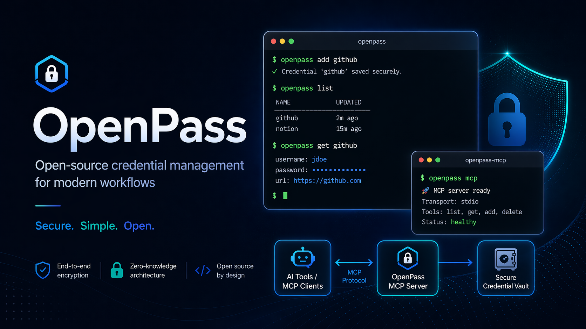

# OpenPass

[](https://github.com/danieljustus/OpenPass/actions/workflows/ci.yml)
[](https://github.com/danieljustus/OpenPass/releases/latest)
[](https://opensource.org/licenses/MIT)
[](https://pkg.go.dev/github.com/danieljustus/OpenPass)
[](https://goreportcard.com/report/github.com/danieljustus/OpenPass)



A modern, secure command-line password manager written in Go. Uses [age](https://age-encryption.org/) for encryption with built-in MCP server support for AI agent integration.

> **Safety Notice**: OpenPass manages sensitive secrets. Use at your own risk, keep tested backups of your vault, and verify recovery before relying on it for critical credentials.

## Features

- **Modern Encryption**: [age](https://age-encryption.org/) (X25519 + ChaCha20-Poly1305)
- **TOTP Support**: Store and generate TOTP codes
- **Clipboard Auto-Clear**: Automatic clearing after timeout
- **Session Caching**: OS keyring with 15-minute TTL
- **Git Integration**: Automatic commits and sync
- **Multi-User Vaults**: age recipients for shared access
- **MCP Server**: stdio and HTTP for AI agent integration
- **Cross-Platform**: macOS, Linux, Windows, FreeBSD

## Installation

### Quick install

**macOS / Linux:**
```bash
curl -sSfL https://raw.githubusercontent.com/danieljustus/OpenPass/main/scripts/install.sh | sh
```

**Windows:**
```powershell
irm https://raw.githubusercontent.com/danieljustus/OpenPass/main/scripts/install.ps1 | iex
```

**Homebrew:**
```bash
brew tap danieljustus/tap
brew install openpass
```

**Scoop:**
```powershell
scoop bucket add openpass https://github.com/danieljustus/scoop-bucket
scoop install openpass
```

**Go:**
```bash
go install github.com/danieljustus/OpenPass@latest
```

| Platform | amd64 | arm64 | Install Methods |
|----------|-------|-------|-----------------|
| macOS | ✓ | ✓ | Quick install, Homebrew, Go, Manual |
| Linux | ✓ | ✓ | Quick install, Homebrew, Go, Manual, deb/rpm/apk |
| Windows | ✓ | ✓ | Quick install, Scoop, Go, Manual |
| FreeBSD | ✓ | ✓ | Go, Manual |

## Quick Start

```bash
# Initialize vault
openpass init

# Add a password
openpass add github
# or non-interactive:
openpass set github.password --value "mysecretpassword"

# Retrieve (auto-copies to clipboard with 45s timeout)
openpass get github.password --clip

# List and search
openpass list
openpass find mybank

# Generate secure passwords
openpass generate --length 32 --symbols

# Session management
openpass unlock   # cache passphrase
openpass lock     # clear cache

# Recipients for multi-user vaults
openpass recipients list
openpass recipients add age1...

# Git sync
openpass git pull
openpass git push

# Backup/Restore
openpass backup ~/backups/openpass-$(date +%Y%m%d).tar.gz
openpass restore ~/backups/openpass-20260427.tar.gz
```

## MCP Server

OpenPass exposes an MCP server for AI agent integration:

```bash
# Stdio mode (recommended for local agents)
openpass serve --stdio --agent claude-code

# HTTP mode
openpass serve --port 8080
```

Generate config snippets: `openpass mcp-config <agent>`

For detailed agent setup, profiles, token management, and observability, see [docs/agent-integration.md](docs/agent-integration.md).

## Configuration

Global config: `~/.openpass/config.yaml`. See [`config.yaml.example`](config.yaml.example) for a commented starting point.

For the full configuration reference, see [docs/configuration.md](docs/configuration.md).

### Environment Variables

- `OPENPASS_VAULT` — Path to vault directory (default: `~/.openpass`)

### Vault Structure

```
~/.openpass/
├── identity.age      # Encrypted age identity
├── config.yaml       # Vault configuration
├── mcp-token         # Bearer token for HTTP MCP
├── entries/          # Encrypted password entries
│   ├── github.age
│   └── work/
│       └── aws.age
└── .git/             # Git repository
```

## Security

- age encryption: X25519 + ChaCha20-Poly1305
- Passphrase never stored in plain text
- Session caching via OS keyring (15-minute TTL)
- Each entry individually encrypted
- Git history contains only ciphertext
- HTTP MCP bound to `127.0.0.1` with bearer token auth
- **No telemetry** (see [SECURITY.md](SECURITY.md#privacy--telemetry))

## Comparison with pass

| Feature | OpenPass | pass (zx2c4) |
|---------|----------|--------------|
| Encryption | age | GPG |
| Session caching | OS keyring | gpg-agent |
| MCP server | Built-in (stdio + HTTP) | No |
| Password generation | Built-in | External tools |

## Dependencies

- Go 1.26 or later
- [filippo.io/age](https://pkg.go.dev/filippo.io/age) — encryption
- [spf13/cobra](https://github.com/spf13/cobra) — CLI framework
- [zalando/go-keyring](https://github.com/zalando/go-keyring) — OS keyring

## Contributing

See [CONTRIBUTING.md](CONTRIBUTING.md) for development setup and PR process.

### Testing

Tests run with `go test ./...`. Some tests are skipped automatically:

- **Slow tests** (`-short` flag): Flow and binary e2e tests skip in short mode. Run without `-short` to execute them.
- **Headless CI**: Tests requiring the OS keyring (session caching) skip when no keyring backend is available (e.g., containerized or headless CI). These are environment-dependent and not failures.

## License

MIT License

## Acknowledgments

- Inspired by [pass](https://www.passwordstore.org/) from zx2c4
- MCP support via [mark3labs/mcp-go](https://github.com/mark3labs/mcp-go)

## Disclaimer

Use at your own risk. Always keep tested backups of your vault.
